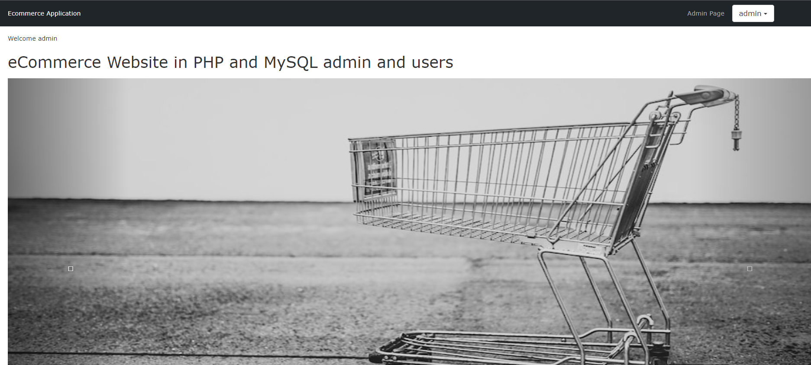

# PHP MySQL Ecommerce Application

A server-rendered ecommerce application with customer and admin workflows, product browsing, authentication, cart management, checkout, and order tracking.

## Features

- Customer registration and login
- Product catalogue with categories and product details
- Cart, checkout, and order history
- Admin product, category, and order management
- Responsive header, mobile navigation, icon-based social footer, and go-to-top control

## Tech stack

PHP, MySQL, HTML, CSS, Sass, JavaScript, jQuery, and Bootstrap.

## Run locally

1. Install PHP, MySQL, and a local server such as XAMPP.
2. Create a MySQL database and import the project schema if available.
3. Update the connection values in `config/connect.php`.
4. Place the repository inside the server document root.
5. Open `http://localhost/ecommerce-web-application-php-mysql/` in a browser.

GitHub Pages deployment is not used because PHP requires a server runtime.

## Links

- Portfolio: [https://www.ashishranjan.net/](https://www.ashishranjan.net/)
- GitHub: [https://github.com/a2rp](https://github.com/a2rp)
- CodePen: [https://codepen.io/ash1198](https://codepen.io/ash1198)
- LinkedIn: [https://www.linkedin.com/in/aashishranjan](https://www.linkedin.com/in/aashishranjan)
- Facebook: [https://www.facebook.com/theash.ashish/](https://www.facebook.com/theash.ashish/)
- YouTube: [https://www.youtube.com/@ashishranjan-ashz?sub_confirmation=1](https://www.youtube.com/@ashishranjan-ashz?sub_confirmation=1)
- Email: [ash.ranjan09@gmail.com](mailto:ash.ranjan09@gmail.com)

## Support

- Support: [https://a2rp-donation-page.netlify.app/](https://a2rp-donation-page.netlify.app/)
- Buy Me a Coffee: [https://buymeacoffee.com/a2rp](https://buymeacoffee.com/a2rp)
- Patreon: [https://www.patreon.com/a2rp](https://www.patreon.com/a2rp)
